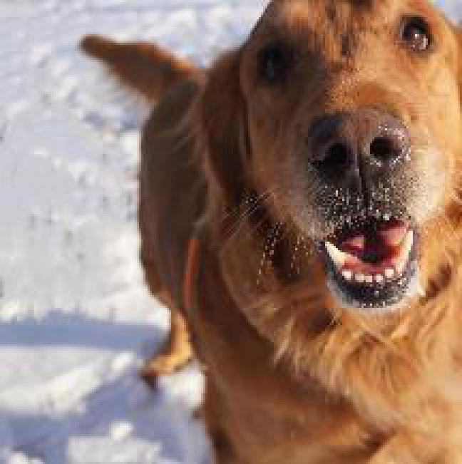
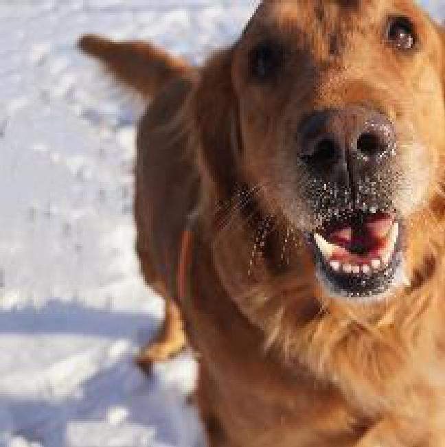

## Image Scale Method for Bilinear Interpolation and Nearest Neighbour

In this project, I use two method including bilinear interopolation and nearest neighbour to scale the photo and display them in the following part.

### Folder Structure
- desc_images: It is used to store processed pictures.
- src_images: It is used to store raw data.
### Display of Image Zooming Effect

The first picture is origin picture with 216*217 resolution.

The second picture is a picture processed by nearest neighbour algorithm where I zoom out the photo by three times. 

The third picture is processed by bilinear interpolation. It is enlarged by three times.

